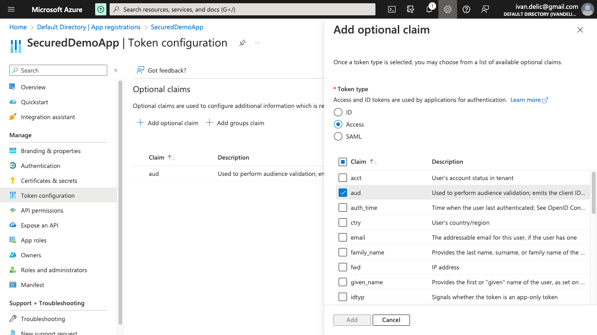
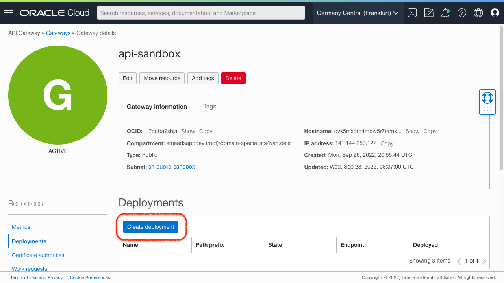
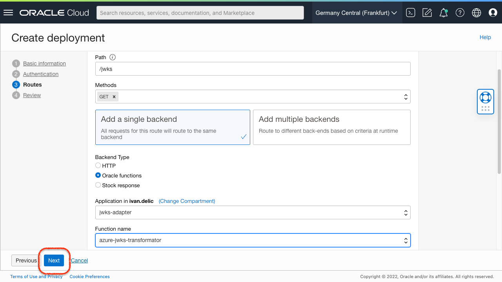
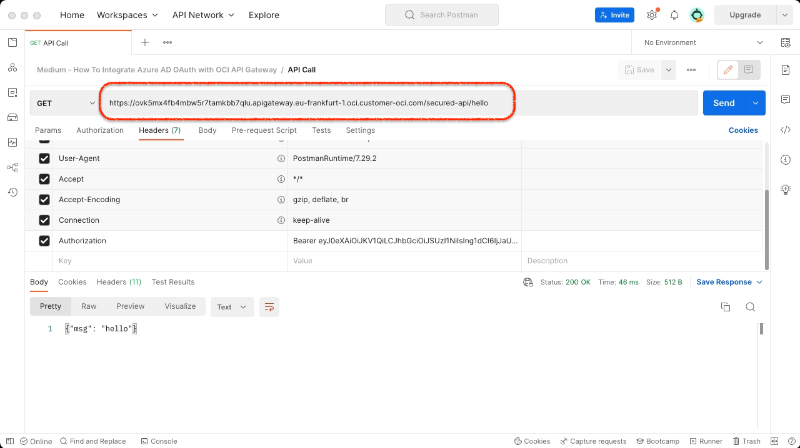

# How to Use Azure AD to Secure OCI API Gateway With OAuth and JWT?

Azure AD is a popular identity and access management (IAM) service in Azure. It's cloud-based and can serve as OAuth 2.0 IdP, making the SSO across multi-cloud easy and fluid. OCI API Gateway is a rock-solid API management solution for securing and controlling APIs in OCI. API Gateway can use Azure AD OAuth capabilities to secure and authorize API endpoints. How to set up OAuth SSO between Azure AD and API Gateway in OCI based on JWT? What if JWKS keys are not compatible between Azure AD and API Gateway? How to configure API Gateway in OCI to use Azure AD-issued JWT? Continue reading and find it out.

Prerequisites:
- You have access to OCI and Azure tenancies.
- You have a client application that needs to connect to API Gateway in OCI. I will be using Visual Builder for a demonstration. Still, you can use any of yours since the application registers in Azure AD and implements simple [OAuth client credential flows](https://learn.microsoft.com/en-us/azure/active-directory/develop/v2-oauth2-client-creds-grant-flow) for JWT issuance.
- You have basic knowledge about [API Gateway](https://docs.oracle.com/en-us/iaas/Content/APIGateway/Concepts/apigatewayoverview.htm) and [Functions](https://docs.oracle.com/en-us/iaas/Content/Functions/Concepts/functionsoverview.htm) in OCI.
- You have created Virtual Cloud Network (VCN) for API Gateway and Functions in OCI

## Introduction
In the multi-cloud era, it's preferred to use distributed components across different hyper-scale clouds. This example will ensure that Azure AD OAuth IdP protects API deployments in OCI using the JWT tokens and OAuth client credential flow. The flow is typically easy to use since it requires exporting (1) JWKS keys from Azure AD IdP and importing them into OCI API Gateway. The client application then invokes Azure AD IdP to (2) issue JWT using client credentials and grabs the JWT from the response. Finally, the client application supplies JWT with the (3) request against protected API Gateway resources in OCI. Three mentioned steps are depicted in the architectural sequence below.


Due to certain limitations in JWKS, related to the absence of ```alg``` field from the keys, we need to develop JWKS Adapter component in OCI, acting as proxy for the sequence (1) above. JWKS Adapter modifies JWKS on the fly by adding the required ```alg``` field, setting it up to ```RS256```. In addition, JWKS Adapter reduces the total size of JWKS by removing ```x5c``` field from the key. JWKS Adapter is built using Functions and API Gateway is OCI.


Target architecture is comprised of four main components:  
- (A) Active Directory OAuth IdP [Azure]  
- (B) JWKS Adapter [OCI]  
- (C) Secured API [OCI]  
- (D) Client Application

JWKS Adapter (B) plays the role of a reverse proxy between (C) Secured API and (A) Active Directory OAuth IdP. The sequence starts with API Gateway (3) retrieving adapted JWKS from another API deployment, serving as a facade for Function. API deployment (2) invokes Functions, which (1) invokes Azure JWKS and modifies it on the fly. When the message is returned to the original requestor (C) JWKS Adapter, it's a set of modified JWKS from Azure, ready to be used in API Gateway.

Ensure to follow next steps:
1. Configure (A) Azure Active Directory OAuth IdP
2. Build and Deploy (B) JWKS Adapter Using OCI Function
3. Deploy (C) Secured API With API Gateway and JWT

## 1. Configure (A) Azure Active Directory OAuth IdP
The goal of this step is to register Client Application and configure Azure Active Directory.

1. Open Azure Active Directory the Azure Console. Register a new Application by selecting ```App registrations``` from the left menu and pressing ```New registration``` button.

2. Give the application frendly name, select option ```Accounts in this organizational directory only (Default Directory only - Single tenant)``` and press ```Register```.

3. Take a note of ```Application (client) ID```, since we will use it as a credential in token generation API.

4. Select ```Certificates & secrets``` from the left menu and press ```New client secret``` button.

5. Fill a short secret description and pick expiry option. By default, expiration of the secret is set to 6 months. The secret will go in pair with ```Application (client) ID``` from step 3. Finally, press ```Add``` button.

6. Take a note of secret by copying ```Value``` field.

7. Select ```Token configuration``` from the left menu and press ```Add optional claim``` button. Then choose ```Access``` token type and select ```aud``` claim. Press ```Add``` button to complete action.

8. Return to the ```Overview``` from the left menu, press ```Endpoints``` button and copy the ```OAuth 2.0 token endpoint (v1)``` URL, which will be used for the issuance of JWT tokens.


## 2. Build and Deploy (B) JWKS Adapter Using OCI Function
The goal is to build JWKS Adapter as a proxy between (A) Active Directory OAuth IdP and (C) Secured API. The reason behind is the absence of ```alg``` field from the keys. JWKS Adapter modifies JWKS on the fly by adding the required ```alg``` field, setting it up to ```RS256```. Function code is located [here](/jwks-adapter/func.js).

1. Create Application for JWKS adapter Function by pressing ```Create application``` button.

2. Make sure you have the proper VCN configured, ready to host the JWKS adapter Function. Enter a name (e.g. ```jwks-adapter```) and press ```Create```.

3. When the Application is created, select ```Getting started``` from the left menu and follow ```Setup fn CLI on Cloud Shell``` guide. Follow the steps form 1 to 7. You will need to launch Cloud Shell by pressing the button or selecting the icon in the upper right part of the page.

4. Keep the Cloud Shell open and clone adapter function from the GitHub
    ```console
    git clone https://github.com/ivandelic/how-to-use-azure-ad-to-secure-oci-api-gateway-with-oauth-and-jwt.git
    ```
5. Go in the function folder
    ```
    cd how-to-use-azure-ad-to-secure-oci-api-gateway-with-oauth-and-jwt/jwks-adapter
    ```
6. Enter the cloned repository and deploy adapter Function to Application created in step 1. Make sure the ```--app``` parameter is equal to Application name. 
    ```
    fn -v deploy --app jwks-adapter
    ```
7. Test the freshly deployed function by invoking
    ```
    fn invoke jwks-adapter azure-jwks-transformator
    ```
    If it's properly configured, it should return something similar to:
    ```
    ivan_delic@cloudshell:~ (eu-frankfurt-1)$ fn invoke jwks-adapter azure-jwks-transformator
    {"keys":[{"kty":"RSA","use":"sig","kid":"nOo3ZDrODXEK1jKWhXslHR_KXEg","x5t":"nOo3ZDrODXEK1jKWhXslHR_KXEg","n":"oaLLT9hkcSj2tGfZsjbu7Xz1Krs0qEicXPmEsJKOBQHauZ_kRM1HdEkgOJbUznUspE6xOuOSXjlzErqBxXAu4SCvcvVOCYG2v9G3-uIrLF5dstD0sYHBo1VomtKxzF90Vslrkn6rNQgUGIWgvuQTxm1uRklYFPEcTIRw0LnYknzJ06GC9ljKR617wABVrZNkBuDgQKj37qcyxoaxIGdxEcmVFZXJyrxDgdXh9owRmZn6LIJlGjZ9m59emfuwnBnsIQG7DirJwe9SXrLXnexRQWqyzCdkYaOqkpKrsjuxUj2-MHX31FqsdpJJsOAvYXGOYBKJRjhGrGdONVrZdUdTBQ","e":"AQAB","alg":"RS256"},...]}
    ```
8. Find your API Gateway from the OCI menu, select ```Deployments```, and press ```Create deployment```. This will expose our adapter Function to be invokable.

8. Fill the ```Name``` and ```Path``` and press ```Next```.

9.  Leave the deployment with ```No Authentication```, since it will only serve to proxy and modify Azure JWKS and adapt it to API Gateway expected format. Press ```Next``` to proceed.

10. Create a Route, define a ```Path``` and ```Methods```. Choose ```Single backend``` with ```Oracle functions``` type. Select Application and Function deployed in the previous steps.

11. Review the deployment and press ```Create```.

12. Wait untill Deployment is in ```Active``` state and copy the ```Endpoint```.

13. Use Postman or similar tool to test the endpoint. Paste copied endpoint and suffix it with ```Route``` path from step 10. It should retrive Azure JWKS with modified values.


## 3. Deploy (C) Secured API With API Gateway and JWT
Goal of the step is to deploy API, secured by JWT.

1. Find your API Gateway from the OCI menu, select ```Deployments```, and press ```Create deployment```. We will create API secured by JWT.

2. Fill the ```Name``` and ```Path``` and press ```Next```.

3. We will protect the API with JSON Web Token (JWT). Under Authentication step, select ```Single Authentication```. Select JWT token location to ```Header``` and define header name to ```Authorization```. Use Authentication scheme ```Bearer```. Press ```Next``` to proceed.

4. Define ```Allowed issuer``` and ```Allowed audience```. Since we used v1 token API, ```Allowed issuer``` should be set to ```https://sts.windows.net/{tenant-id}/```. Replace {tenant-id} with your Azure tenant ID. ```Allowed audience``` should contain aud claim value, and by default, unless explicitly set, it is ```00000002-0000-0000-c000-000000000000```.

5. For Public keys make sure to select ```Remote JWKS``` and enter ```JWKS URI``` to match deployment of ```JWKS Adapter``` Function

6. Create a Route, define a ```Path``` and ```Methods```. Choose ```Single backend``` with ```Stock response``` type. Define simple Body and Status code. Press Next to proceed.

7. Review the deployment and press ```Create```.

8. Wait untill Deployment is in ```Active``` state and copy the ```Endpoint```.

9. Use Postman to retrive JWT token from Azure AD. Enter token API URL https://login.microsoftonline.com/{tenant-id}/oauth2/token, while replacing {tenant-id} with your Azure tenant ID. Send a request and copy ```access_token``` value.

10. Finally, use Postman to test secured API endpoint. Paste copied endpoint and suffix it with ```Route``` path from step 6. Add Authorization header, use Bearer scheme and paste JWT token issued in the previous step. It should retrive demo body from the step 6.


