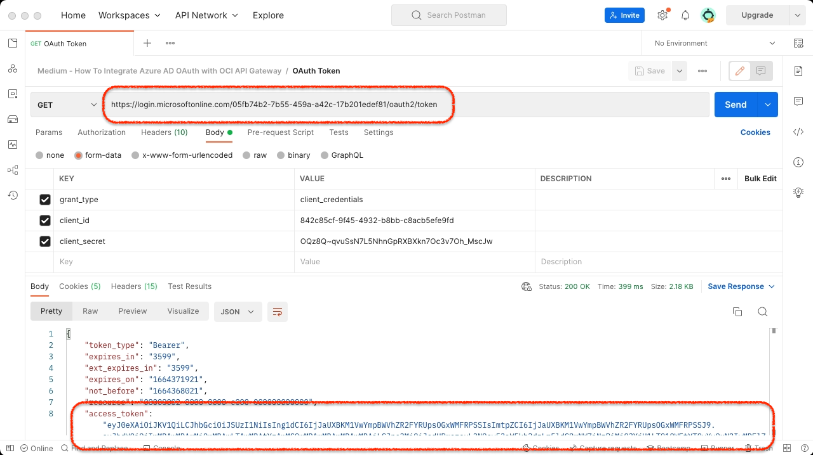

# How to Use Azure AD to Secure OCI API Gateway With OAuth and JWT?

Azure AD is one of the major identity and access management services. It's cloud based and can serve as OAuth 2.0 IdP, making the SSO across multi-cloud easy and fluid. OCI API Gateway is a rock-solid API management solution for securing and controlling APIs. OCI API Gateway can use Azure AD OAuth capabilties to secure and authorize API endpoints. How to setup OAuth SSO beetween Azure AD and OCI API Gateway based on JWT? How to adapt JWKS key formats? How to configure OCI API Gateway to use Azure AD JWT? Continue reading and find it out.

Prerequisites:
1. You have client application that needs to connect to OCI API Gateway.
2. You have Azure AD tenancy.
3. You are familiar with OCI API Gateway and OCI Functions
4. You have set up VCN for OCI API Gateway and Functions

## Introduction


Architecture comprises four main components:  
a) Active Directory OAuth IdP [Azure]  
b) JWKS Adapter [OCI]  
c) Secured API [OCI]  
d) Client Application

This guide will demonstrate:
1. Configure (a) Azure Active Directory OAuth IdP
2. Build and Deploy (b) JWKS Adapter Using OCI Function
3. Deploy (c) Secured API With API Gateway and JWT

## Configure (a) Azure Active Directory OAuth IdP

1. Open Azure Active Directory the Azure Console. Register a new Application by selecting ```App registrations``` from the left menu and pressing ```New registration``` button.

2. Give the application frendly name, select option ```Accounts in this organizational directory only (Default Directory only - Single tenant)``` and press ```Register```.

3. Take a note of ```Application (client) ID```, since we will use it as a credential in token generation API.

1. Select ```Certificates & secrets``` from the left menu and press ```New client secret``` button.

5. Fill a short secret description and pick expiry option. By default, expiration of the secret is set to 6 months. The secret will go in pair with ```Application (client) ID``` from step 3. Finally, press ```Add``` button.

6. Take a note of secret by copying ```Value``` field.

7. Return to the ```Overview``` from the left menu, press ```Endpoints``` button and copy the ```OAuth 2.0 token endpoint (v1)``` URL, which will be used for the issuance of JWT tokens.


## Build and Deploy (b) JWKS Adapter Using OCI Function

1. Create Application for JWKS adapter Function by pressing ```Create application``` button.

2. Make sure you have the proper VCN configured, ready to host the JWKS adapter Function. Enter a name (e.g. ```jwks-adapter```) and press ```Create```.

3. When the Application is created, select ```Getting started``` from the left menu and follow ```Setup fn CLI on Cloud Shell``` guide. Follow the steps form 1 to 7. You will need to launch Cloud Shell by pressing the button or selecting the icon in the upper right part of the page.

4. Keep the Cloud Shell open and clone adapter function from the GitHub
    ```console
    git clone https://github.com/ivandelic/how-to-use-azure-ad-to-secure-oci-api-gateway-with-oauth-and-jwt.git
    ```
5. Enter the cloned repository and deploy adapter Function to Application created in step 1. Make sure the ```--app``` parameter is equal to Application name. 
    ```
    fn -v deploy --app jwks-adapter
    ```
6. Test the freshly deployed function by invoking
    ```
    fn invoke jwks-adapter azure-jwks-transformator
    ```
    If it's properly configured, it should return something similar to:
    ```
    ivan_delic@cloudshell:~ (eu-frankfurt-1)$ fn invoke jwks-adapter azure-jwks-transformator
    {"keys":[{"kty":"RSA","use":"sig","kid":"nOo3ZDrODXEK1jKWhXslHR_KXEg","x5t":"nOo3ZDrODXEK1jKWhXslHR_KXEg","n":"oaLLT9hkcSj2tGfZsjbu7Xz1Krs0qEicXPmEsJKOBQHauZ_kRM1HdEkgOJbUznUspE6xOuOSXjlzErqBxXAu4SCvcvVOCYG2v9G3-uIrLF5dstD0sYHBo1VomtKxzF90Vslrkn6rNQgUGIWgvuQTxm1uRklYFPEcTIRw0LnYknzJ06GC9ljKR617wABVrZNkBuDgQKj37qcyxoaxIGdxEcmVFZXJyrxDgdXh9owRmZn6LIJlGjZ9m59emfuwnBnsIQG7DirJwe9SXrLXnexRQWqyzCdkYaOqkpKrsjuxUj2-MHX31FqsdpJJsOAvYXGOYBKJRjhGrGdONVrZdUdTBQ","e":"AQAB","alg":"RS256"},...]}
    ```
7. Find your API Gateway from the OCI menu, select ```Deployments```, and press ```Create deployment```. This will expose our adapter Function to be invokable.

8. Fill the ```Name``` and ```Path``` and press ```Next```.

9.  Leave the deployment with ```No Authentication```, since it will only serve to proxy and modify Azure JWKS and adapt it to API Gateway expected format. Press ```Next``` to proceed.

10. Create a Route, define a ```Path``` and ```Methods```. Choose ```Single backend``` with ```Oracle functions``` type. Select Application and Function deployed in the previous steps.

11. Review the deployment and press ```Create```.

12. Wait untill Deployment is in ```Active``` state and copy the ```Endpoint```.

13. Use Postman or similar tool to test the endpoint. Paste copied endpoint and suffix it with ```Route``` path from step 10. It should retrive Azure JWKS with modified values.


## Deploy (c) Secured API With API Gateway and JWT
Goal is to deploy API secured by JWT issed by Azure AD.

1. Find your API Gateway from the OCI menu, select ```Deployments```, and press ```Create deployment```. We will create API secured by JWT.
   
2. Fill the ```Name``` and ```Path``` and press ```Next```.
   
3. We will protect the API with JSON Web Token (JWT). Under Authentication step, select ```Single Authentication```. Select JWT token location to ```Header``` and define header name to ```Authorization```. Use Authentication scheme ```Bearer```. Press ```Next``` to proceed.
   
4. Define ```Allowed issuer``` and ```Allowed audience```. Since we used v1 token API, ```Allowed issuer``` should be set to ```https://sts.windows.net/{tenant-id}/```. Replace {tenant-id} with your Azure tenant ID. ```Allowed audience``` should contain aud claim value, and by default, unless explicitly set, it is ```00000002-0000-0000-c000-000000000000```.
   
5. For Public keys make sure to select Remote JWKS and enter JWKS URI to match deployment of adapter Function
   
6. Create a Route, define a ```Path``` and ```Methods```. Choose ```Single backend``` with ```Stock response``` type. Define simple Body and Status code. Press Next to proceed.
   
7. Review the deployment and press ```Create```.
   
8. Wait untill Deployment is in ```Active``` state and copy the ```Endpoint```.
   
9.  Use Postman to retrive JWT token from Azure AD. Enter token API URL https://login.microsoftonline.com/{tenant-id}/oauth2/token, while replacing {tenant-id} with your Azure tenant ID. Send a request and copy the JWT token
   
10. Use Postman to test secured API endpoint. Paste copied endpoint and suffix it with ```Route``` path from step 6. Add Authorization header, use Bearer scheme and paste JWT token issued in the previous step. It should retrive demo body from the step 6.
    

